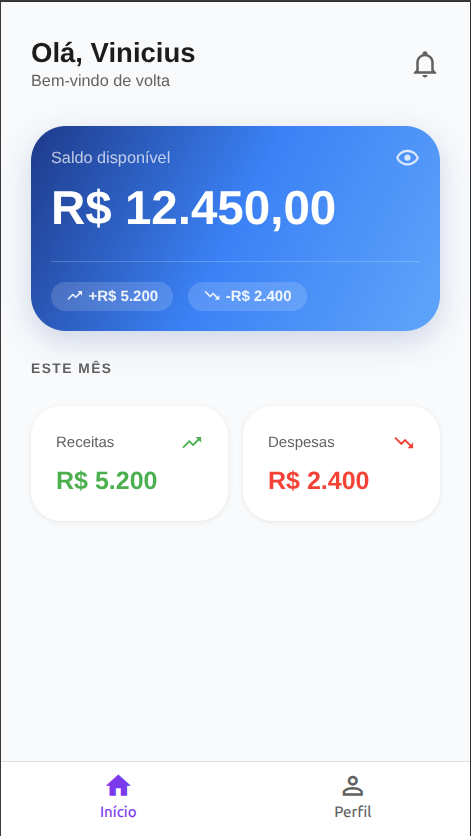
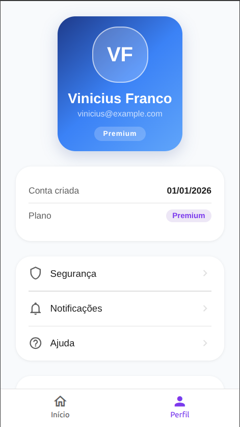
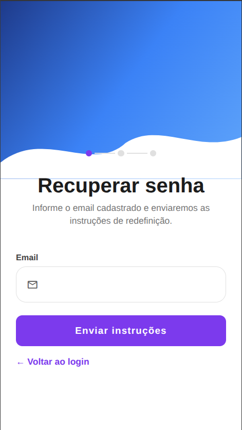

# FinanceApp — Controle financeiro no bolso

> Gerencie seu dinheiro com clareza. Veja seu saldo, acompanhe receitas e despesas, e tenha tudo protegido com autenticação segura — direto no seu celular.

<div align="center">
  
  
  
</div>

---

## O que o app oferece

- **Painel financeiro** — saldo disponível, entradas e saídas do mês em um só lugar
- **Autenticação completa** — login, criação de conta e recuperação de senha em 3 etapas
- **Privacidade na ponta dos dedos** — oculte o saldo com um toque
- **Perfil do usuário** — visualize dados da conta, plano e acesse configurações

---

## Telas

<div align="center">
  
  
  
  
  
</div>

---

## Por que essas tecnologias?

| Tecnologia | Por que foi escolhida |
|---|---|
| **React Native + Expo** | Escreva uma vez, rode no Android, iOS e Web. O Expo elimina a configuração nativa e acelera o ciclo de desenvolvimento sem abrir mão de uma experiência próxima ao nativo. |
| **TypeScript** | Erros de tipo são capturados antes de chegar ao usuário. Em um app financeiro — onde dados incorretos têm impacto real — tipagem estrita é inegociável. |
| **Redux Toolkit** | Estado global previsível e rastreável. O fluxo de autenticação e os dados financeiros precisam ser consistentes em todas as telas; o Redux garante isso sem boilerplate excessivo. |
| **React Navigation** | Navegação nativa fluida com suporte a pilhas e abas. Permite proteger rotas autenticadas de forma declarativa, mantendo o código limpo. |
| **Expo Linear Gradient + SVG** | Visual atrativo sem imagens estáticas. Os gradientes e a onda orgânica são gerados em código, responsivos a qualquer tamanho de tela. |
| **json-server** | API mock realista em segundos. Permite desenvolver e testar fluxos completos (login, cadastro, dados do usuário) sem depender de um back-end real. |
| **redux-persist** | Sessão persistida entre aberturas do app. O usuário não precisa fazer login toda vez — experiência profissional desde o primeiro uso. |

---

## Como rodar

```bash
# 1. Instale as dependências
npm install

# 2. Inicie a API mock (necessário para login e dados)
npm run api

# 3. Inicie o app
npm start
```

Escaneie o QR code com o **Expo Go** (Android/iOS) ou pressione `w` para abrir no navegador.

> Conta de teste: `vinicius@example.com` / `Senha@123`
