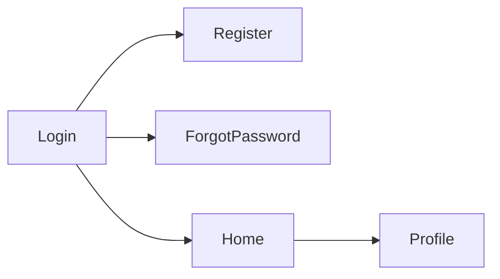
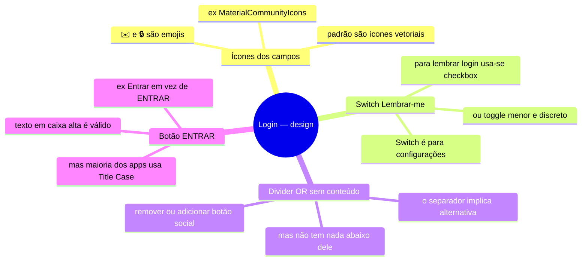
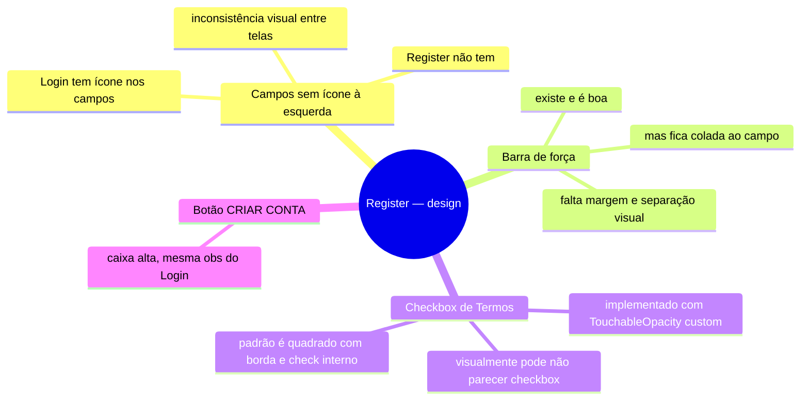
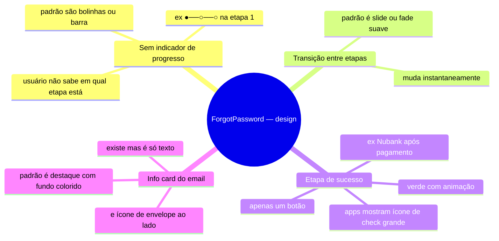
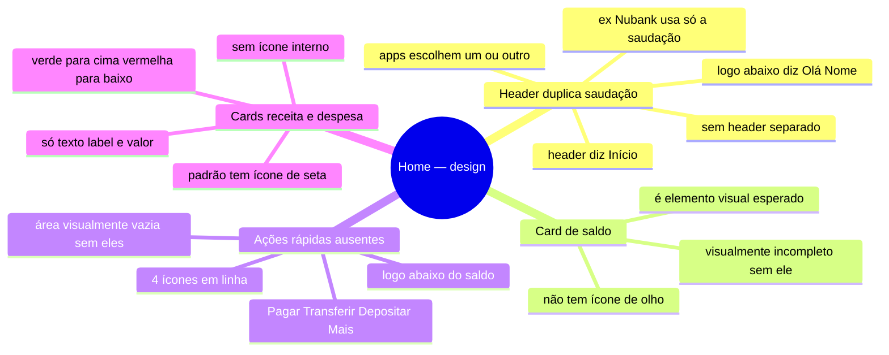
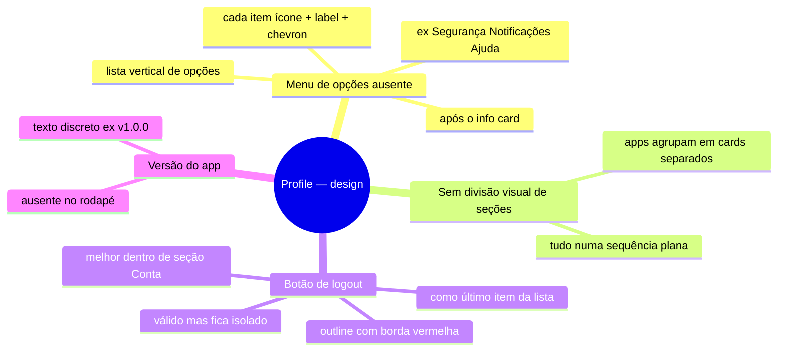

# Análise Visual das Telas — Design vs. Padrões de Mercado

> Foco: elementos **visuais e de layout** que faltam ou diferem do padrão comum em apps (Nubank, Inter, Google, Instagram etc.)

---

## Fluxo das telas analisadas



---

## Login

### Layout atual
```
[ Logo / Ícone ]
[ Título + Subtítulo ]
[ Campo Email  (ícone ✉️ emoji) ]
[ Campo Senha  (ícone 🔒 emoji) ]
[ Switch Lembrar-me | Esqueceu a senha? ]
[ Botão ENTRAR ]
[ ── ou ── ]
[ Não tem conta? Criar conta ]
```

### Problemas visuais



| Elemento | Atual | Padrão de mercado |
|---|---|---|
| Ícone de campo email | ✉️ emoji | `email-outline` (MaterialCommunityIcons) |
| Ícone de campo senha | 🔒 emoji | `lock-outline` (MaterialCommunityIcons) |
| "Lembrar-me" | Switch toggle | Checkbox pequeno |
| Divider "ou" | Existe mas sem alternativa | Remover ou colocar botão social |
| Label do botão | `ENTRAR` | `Entrar` |

---

## Register

### Layout atual
```
[ Ícone + Título + Subtítulo ]
[ Campo Nome    (sem ícone) ]
[ Campo Email   (sem ícone) ]
[ Campo Senha   (sem ícone) ]
[ Barra força da senha ]
[ Campo Confirmar Senha ]
[ Mensagem de match ]
[ Checkbox Termos ]
[ Botão CRIAR CONTA ]
[ Já tem conta? Entrar ]
```

### Problemas visuais



| Elemento | Atual | Padrão de mercado |
|---|---|---|
| Ícones nos campos | Ausentes | Ícone à esquerda em todos os campos |
| Barra de força | Existe mas sem respiro | Espaçamento maior entre barra e próximo campo |
| Checkbox de termos | Custom sem estilo claro | Quadrado com borda + check interno visível |

---

## ForgotPassword

### Layout atual (3 etapas sem indicador)
```
Etapa 1: [ Header ] [ Campo email ] [ Botão ] [ Voltar ]
Etapa 2: [ Header ] [ Info email ] [ Nova senha ] [ Confirmar ] [ Reenviar ]
Etapa 3: [ Header ] [ Botão Voltar ao login ]
```

### Problemas visuais



| Elemento | Atual | Padrão de mercado |
|---|---|---|
| Indicador de etapas | Ausente | Stepper: `● ─ ○ ─ ○` no topo |
| Transição entre steps | Instantânea | Slide lateral ou fade |
| Tela de sucesso (etapa 3) | Só botão | Ícone ✓ grande + mensagem + botão |
| Card do email confirmado | Texto plano | Fundo colorido + ícone de envelope |

---

## Home

### Layout atual
```
[ Header "Início" com bordas arredondadas ]
[ Saudação: Olá, Nome ]
[ Card saldo com gradiente azul ]
[ Cards Receitas | Despesas ]
```

### Problemas visuais



| Elemento | Atual | Padrão de mercado |
|---|---|---|
| Header + Saudação | Ambos presentes (duplicação) | Um ou outro, não os dois |
| Ícone ocultar saldo | Ausente | Olho (`eye-outline`) ao lado do valor |
| Ícone nos cards de métrica | Ausente | Seta ↑ verde / ↓ vermelha |
| Área abaixo do saldo | Vazia | Row de ações rápidas com ícone + label |

---

## Profile

### Layout atual
```
[ Header "Perfil" com bordas arredondadas ]
[ Avatar com iniciais ]
[ Nome + Email ]
[ Info Card: Conta criada | Plano ]
[ Botão Sair da conta ]
```

### Problemas visuais



| Elemento | Atual | Padrão de mercado |
|---|---|---|
| Menu de opções | Ausente | Lista: ícone + label + `›` |
| Agrupamento visual | Tudo plano | Cards separados por seção |
| Logout | Botão isolado | Último item do menu, com ícone de saída |
| Versão do app | Ausente | Texto discreto no rodapé |

---

## Resumo geral — prioridade de design

```mermaid
graph TD
    A[Alta prioridade] --> A1[Trocar emojis por ícones vetoriais nos campos]
    A --> A2[Stepper visual no ForgotPassword]
    A --> A3[Tela de sucesso com ícone grande no ForgotPassword]
    A --> A4[Menu de opções com chevron no Profile]
    A --> A5[Remover duplicação Header + Saudação na Home]

    B[Média prioridade] --> B1[Ícone de olho para ocultar saldo]
    B --> B2[Ícones nos cards de Receita e Despesa]
    B --> B3[Ícones nos campos do Register igual ao Login]
    B --> B4[Switch → Checkbox no Lembrar-me]

    C[Baixa prioridade] --> C1[Divider OR sem alternativa — remover]
    C --> C2[Labels de botão em Title Case]
    C --> C3[Versão do app no rodapé do Profile]
    C --> C4[Card do email com destaque visual no ForgotPassword]
```


